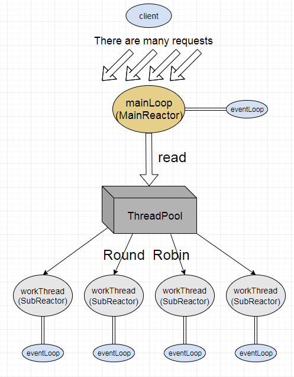
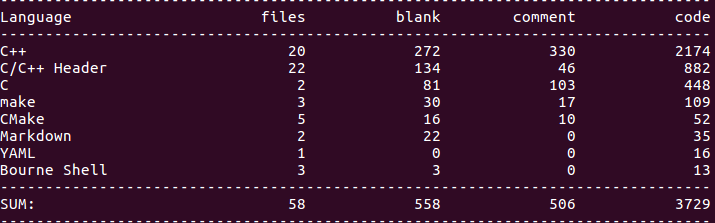

# A High-performance Web Server

## Description:
C++编写的web服务器，借鉴了《muduo网络库》的思想；使用了Reactor并发模型，非阻塞IO+线程池；解析了get、head请求；并实现了异步日志，记录服务器运行状态。

## Environment:
    -OS: ubuntu 16.04
    -Complier: g++5.4
    
## Build:
    ./build.sh

## Usage:
    ./WebServer [-t thread_numbers] [-p port] (using default log_file_path ./WebServer.log)

## Architecture：

## Technical Point:

- 使用Reactor模式 + EPOLL(ET)边沿触发的IO多路复用技术,非阻塞IO。
- 使用双缓冲区技术实现了简单的异步日志系统。
- 

## Count Lines of Code:

## Future:

## 参考链接
    

    

