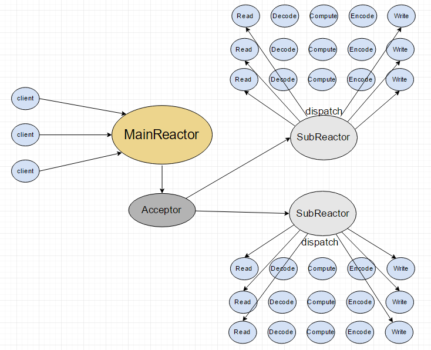
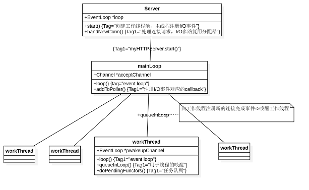

# Architecture:
`I/O` 多路复用（事件分配器） + 非阻塞`I/O` + 主线程（处理请求）+ 工作线程（读、计算、写） + `eventloop`，即`Reactor`反应堆模式。

## Reactor:
`Reactor`设计模式是`event-driven architecture`的一种实现方式，处理多个客户端向服务端请求服务的场景。每种服务在服务端可能由多个方法组成。`Reactor`会解耦并发请求的服务并分发给对应的事件处理器来处理。

`MainReactor`只有一个，负责响应`client`的连接请求，并建立连接，它使用一个`NIO Selector`。在建立连接后用`Round Robin`的方式分配给某个`SubReactor`，因为涉及到跨线程任务分配，需要加锁，这里的锁由某个特定线程中的`loop`创建，只会被该线程和主线程竞争。

`SubReactor`可以有一个或多个，每个`SubReactor`都会在一个独立线程中运行，并且维护一个独立的`NIO Selector`。当主线程把新连接分配给了某个`SubReactor`，该线程此时可能正阻塞在多路选择器（`epoll`）的等待中，怎么得知新连接的到来呢？这里使用了`eventfd`进行异步唤醒，线程会从`epoll_wait`中醒来，得到活跃事件，进行处理。

本项目中的`Reactor`主要由以下几个部分构成：

- `Channel {Channel.h,Channel.cpp}`
- `Epoll {Epoll.h,Epoll.cpp}`
- `EventLoop{EventLoop.h,EventLoop.cpp,EventLoopThread.h,EventLoopThread.cpp,EventLoopThreadPoll.h,EventLoopThreadPool.cpp}`

`Channel`: `Channel`是`Reactor`结构中的“事件”，它自始至终都属于一个`EventLoop`，因此每个`Chanenl`对象都只属于某一个IO线程；负责一个文件描述符的IO事件的分发，但它并不拥有这个文件描述符；在`Channel`类中保存IO事件的类型对应的回调函数，当IO事件发生时，最终会调用到`Channel`类中的回调函数。因此，程序中所有带有读写时间的对象都会和一个`Channel`关联，包括`loop`中的`eventfd`，`listenfd`，`HttpData`等。

`EventLoop`: `One loop per thread` 顾名思义每个线程只能有一个`EventLoop`对象；`EventLoop`即是时间循环，每次从`poller`里拿活跃事件，并给到`Channel`里分发处理。`EventLoop`中的`loop`含糊是会在最底层(`Thread`)中被真正调用，开始无限的循环，直到某一轮的检查到退出状态后从底层一层一层的退出。

`EventLoopThread`:  IO线程不一定是主线程，我们可以在任何一个线程创建并运行`EventLoop`。一个程序也可以有不止一个IO线程，我们可以按优先级将不同的socket分给不同的IO线程，避免优先级反转。`EventLoopThread`会启动自己的线程。

`EventLoopThreadPool`： `EventLoop`线程池，每一个`EventLoopThread`就是一个`SubReactor`，按照轮询的方式分发请求。

`Epoll`: `Epoll`是`IO mutilplexing`的封装。

## Log：
多线程异步日志库：`log`的实现分为前端和后端，前端往后端写，后端往磁盘写。为什么要这样区分前端和后端呢？因为只要涉及到IO，无论是网络IO还是磁盘IO，肯定是慢的，慢就会影响其他操作。

这里的`Log`前端就是前所述的IO线程，负责产生`log`，后端是`Log`线程，设计了多个缓冲区，负责收集前端产生的log，集中往磁盘写。这样`Log`写到后端是没有障碍的，把慢的动作交给后端去做好了。

后端主要是由多个缓冲区构成的，缓冲区满了或者时间到了就向文件写一次。采用了`muduo`介绍的“双缓冲区”思想，实际采用4个多的缓冲区。4个缓冲区分两组，每组的两个一个为主要的，另一个防止第一个写满了没地方写，写满或者时间到了就和另外两个交换指针，然后把满的往文件里写。

日志库包括以下的几个部分：

- `FileUtil {FileUtil.h, FileUtil.cpp}`
- `LogFile {LogFile.h, LogFile.cpp}`
- `AsyncLogging {AsyncLogging.h, AsyncLogging.cpp}`
- `LogStream { LogStream.h, LogStream.cpp}`
- `Logging {Logging.h, Logging.cpp}`

前4个类每个类中都含有一个`append`函数，`Log`的设计也主要是围绕这个`append`函数展开的。

`FileUtil`是最底层的文件类，封装了`Log`文件的打开，写入并在类析构的时候关闭文件，底层使用了标准IO，该`append`函数直接向文件写。

`LogFile`进一步封装了`FileUtil`，并设置了一个循环次数，每过多少次就`flush`一次。

`AsyncLogging`是核心，它负责启动一个`log`线程，专门用来将`log`写入`LogFile`，应用了“双缓冲技术”，其实有4个以上的缓冲区。`AsyncLogging`负责（定时或被填满时）将缓冲区中的数据写入`LogFile`中。

`LogStream`主要用来格式化输出，重载了<<运算符，同时也有自己的一块缓冲区，这里缓冲区的存在是为了缓存一行，把多个<<的结果连成一块。

`Logging`是对外接口，`Logging`类内涵一个`LogStream`对象，主要是为了每次打`log`的时候，在`log`之前和之后加上固定的格式化信息，比如输出打`log`的行号，文件名等信息。

## Other：
其他文件：

- `base`：存放的是一些基础代码，封装了`pthread`的常用功能（互斥器，条件变量，线程），并仿照`java concurrent`编写了`CountDownLatch`。
- `tests`：存放的是服务器的测试代码，客户端测试和日志测试。

## 处理流程

- 创建主线程（主线程注册/IO事件）监听请求并维持`eventloop`，创建工作线程池处理后续事件并维持`eventloop`。
- 监听到请求，主线程从阻塞的`eventloop`唤醒，处理连接请求并以IO事件封装给工作线程池（轮询的方式分配）的任务队列，每次都会通过`TimeManager`处理超时的请求并关闭清除。
- 工作线程从`eventloop`唤醒，工作线程处理后续操作，读，计算解析`http`报文（状态机）；写：根据解析的结果返回`http`应答（如果出现错误可选择关闭连接），服务器可选择关闭连接（长连接或短连接）每次都会通过`TimeManager`处理超时的请求并关闭清除。可以根据不同的情况优雅的关闭连接。

